# 🧠 Context Engineering & Agent Memory 

> **TL;DR:** Context engineering is the art + science of managing *what* an AI agent sees at each step. Better context = better performance, lower cost, fewer failures.

---

## 📌 Table of Contents

1. [What is Context Engineering?](#1-what-is-context-engineering)
2. [Why It Matters for AI Agents](#2-why-it-matters-for-ai-agents)
3. [Core Strategy Overview](#3-core-strategy-overview)
4. [Agent Memory Types](#4-agent-memory-types)
5. [Memory Failure Modes](#5-memory-failure-modes)
6. [Toolkit of Techniques](#6-toolkit-of-techniques)
7. [Short-Term Techniques Deep Dive](#7-short-term-techniques-deep-dive)
8. [Long-Term / Cross-Session Memory](#8-long-term--cross-session-memory)
9. [Prompt & Tool Hygiene](#9-prompt--tool-hygiene)
10. [Agent Context Profiles](#10-agent-context-profiles)
11. [Memory Design Best Practices](#11-memory-design-best-practices)
12. [Evaluating Memory Performance](#12-evaluating-memory-performance)
13. [Scaling Agent Memory Systems](#13-scaling-agent-memory-systems)
14. [Memory Pruning & Temporal Decay](#14-memory-pruning--temporal-decay)
15. [Key Takeaways & Resources](#15-key-takeaways--resources)

---

## 1. What is Context Engineering?

| Dimension | Description |
|-----------|-------------|
| **Art** | Judgment — knowing *what* information is most relevant at each reasoning step |
| **Science** | Systematic, repeatable patterns with measurable impact |

> 💡 **Core insight:** LLM performance depends heavily on *context quality*, not just the model's inherent capability.

### Disciplines Ecosystem

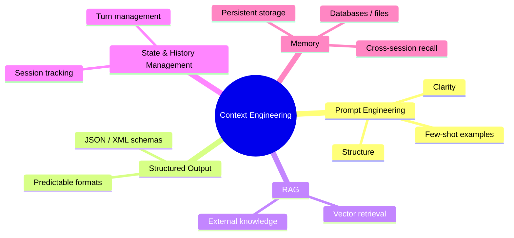

---

## 2. Why It Matters for AI Agents

Without proper context management, long-running or tool-heavy agents can:

- 🔺 **Bloat tokens** → higher costs + slower processing
- 🌀 **Degrade quality** → confusion, "poisoning noise", context overflow (bursting)

---

## 3. Core Strategy Overview

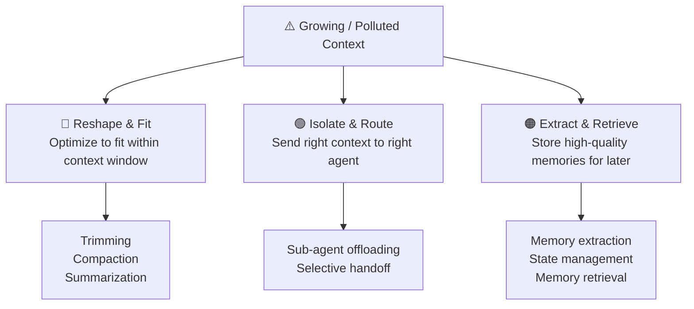

---

## 4. Agent Memory Types

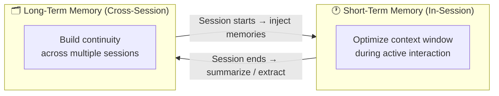

### The Core Bottleneck

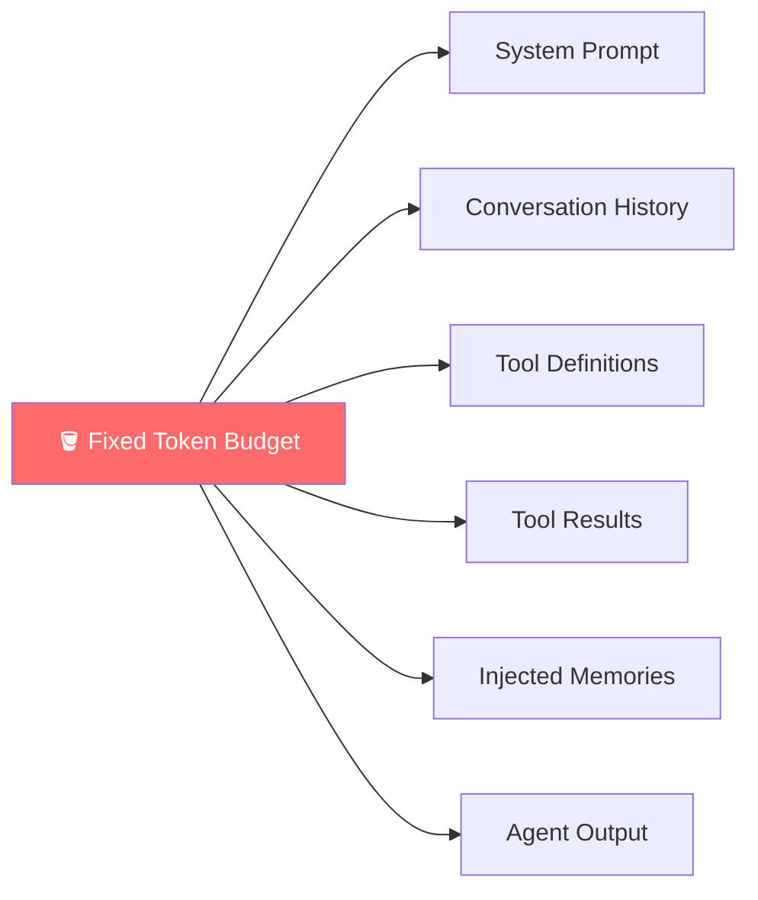

> Every component **competes** for the same fixed token budget. This is the fundamental challenge.

---

## 5. Memory Failure Modes

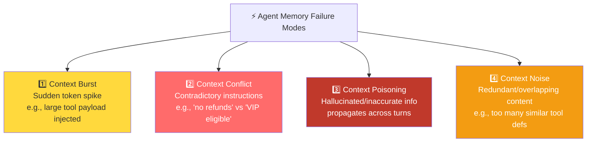

### Failure Mode Quick Reference

| Failure | Trigger | Symptom | Fix |
|---------|---------|---------|-----|
| **Burst** | Large tool result dumped | Token spike in one turn | Trim tool outputs; compaction |
| **Conflict** | Contradictory instructions | Wrong action taken | Remove conflicting prompts; clear precedence rules |
| **Poisoning** | Hallucination in summary | Error propagates downstream | Strict summarization prompts; fact-check guards |
| **Noise** | Too many similar tools | Model picks wrong tool | Minimize + differentiate tool set |

---

## 6. Toolkit of Techniques

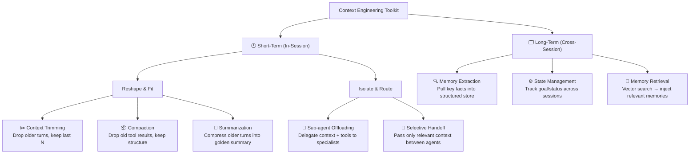

---

## 7. Short-Term Techniques Deep Dive

### Static vs. Dynamic Tokens

| Type | Examples | Control Level |
|------|---------|--------------|
| **Static** | System prompt, tool definitions, examples | Low — fixed per session |
| **Dynamic** | Tool results, memories, conversation history | High — prime targets for optimization |

> 🎯 Focus optimization efforts on **dynamic tokens** — they scale with session length.

---

### Context Trimming

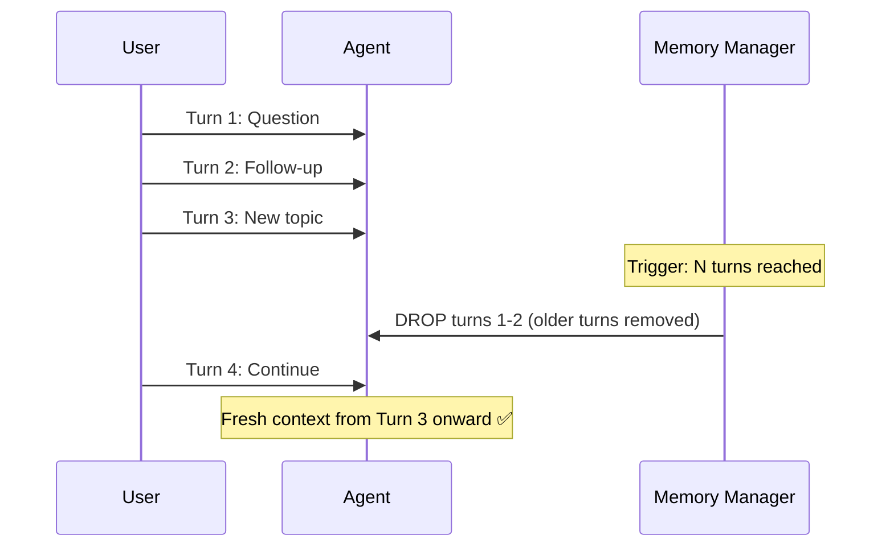

**When to use trimming:**
- Tool-heavy agents with independent tasks
- Short workflows where older data won't be needed
- Speed is priority (zero added latency)

**⚠️ Rule:** Never trim mid-turn — always respect full turn blocks (user msg + all agent responses until next user msg).

---

### Context Compaction

Similar to trimming, but **only removes tool call results** (not the structural placeholders).

```
Before compaction:           After compaction:
[Turn 1: User msg]           [Turn 1: User msg]
[Turn 1: Tool call]          [Turn 1: Tool call placeholder ✓]
[Turn 1: Tool result 📦]  →  [Turn 1: Tool result REMOVED ✗]
[Turn 2: Agent response]     [Turn 2: Agent response]
```

**When to use compaction:**
- Tool-heavy workflows where result data is no longer needed
- Keep conversation structure intact
- Reduce noise without losing conversational flow

---

### Context Summarization

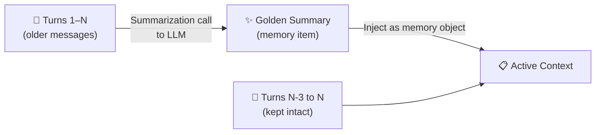

**Summary prompt must ensure:**
- No contradictions introduced
- Temporal ordering preserved
- No hallucinations
- Captures: device info, issues, steps tried, outcomes, current status, next steps

---

### Trimming vs. Compaction vs. Summarization

| Dimension | Trimming | Compaction | Summarization |
|-----------|----------|-----------|---------------|
| **What's removed** | Entire old turns | Tool results only | All old turns → compressed |
| **Info loss** | ✅ Yes | ⚠️ Partial | ❌ None (compressed) |
| **Latency** | ⚡ None | ⚡ None | 🐢 Slight (extra LLM call) |
| **Cost** | 💚 Cheapest | 💚 Cheap | 🟡 Moderate |
| **Best for** | Independent tasks / tool workflows | Tool-heavy agents | Dependent tasks / coaching / planning |

---

### Decision Heuristics

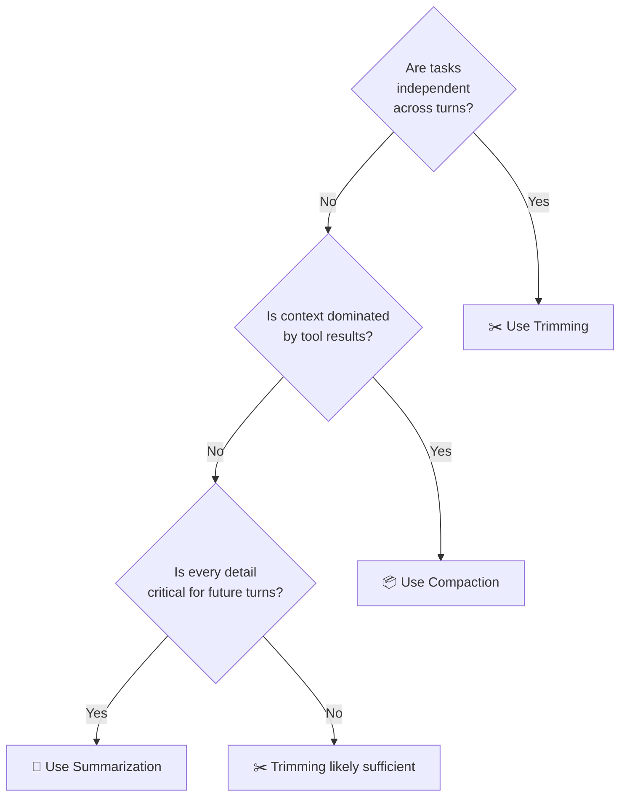

**Proactive thresholds (don't wait for limits to hit):**
- 🟡 At **40%** of context limit → start monitoring
- 🔴 At **80%** of context limit → trigger trimming/compaction

---

## 8. Long-Term / Cross-Session Memory

### Cross-Session Flow

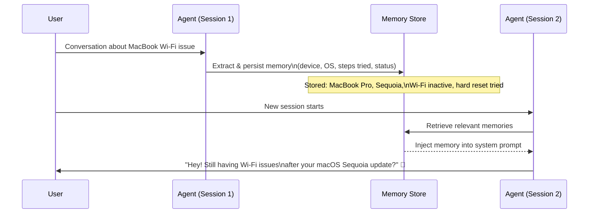

### Memory Guard Rails

```
✅ DO:
  - Use precedence rules ("memory may be stale — verify with user")
  - Apply temporal tags (timestamp when memory was learned)
  - Separate global vs. session scope

❌ DON'T:
  - Store secrets or PII
  - Over-rely on memory without allowing override
  - Let stale memory override fresh user input
```

---

### Memory Scope

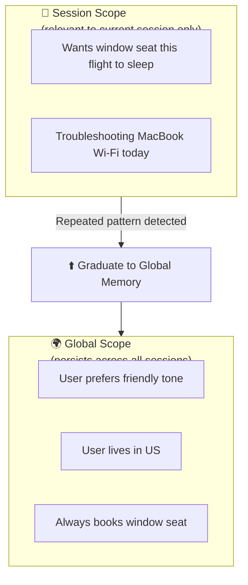

---

### Advanced Memory Techniques

| Technique | Description | Storage |
|-----------|-------------|---------|
| **Extraction** | Dedicated tool extracts key facts mid-session in JSON/structured format | DB / file |
| **State Management** | State object (current goal, status) injected into system prompt each turn | In-memory / DB |
| **Retrieval (RAG-style)** | Memories stored in vector DB; search → rank → inject at session start | Vector DB |

---

## 9. Prompt & Tool Hygiene

### System Prompt Best Practices

- ✅ **Lean, clear, well-structured** — no bloat
- ✅ **Small canonical few-shot examples** — quality over quantity
- ✅ **Explicit and direct language** — no ambiguity
- ✅ **Space for planning** — especially with reasoning models
- ❌ **Avoid overlapping instructions** — leads to conflict
- ❌ **Avoid vague or duplicate tool definitions** — causes noise

### Tool Design Rules

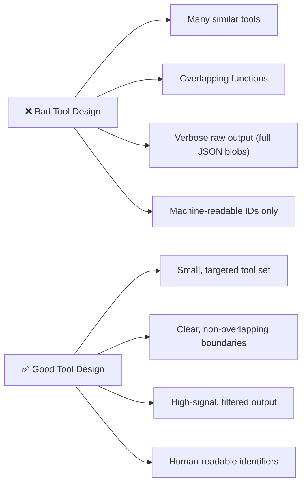

---

## 10. Agent Context Profiles

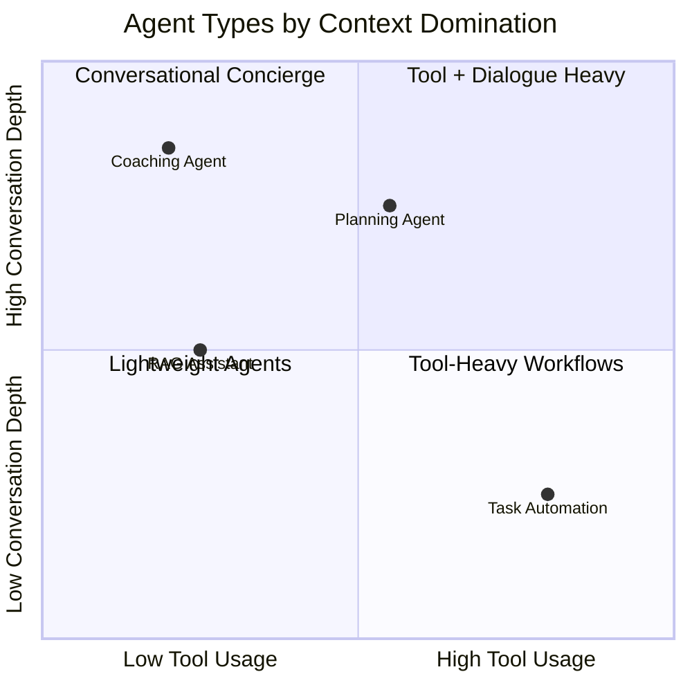

| Profile | Context Dominated By | Best Technique |
|---------|---------------------|----------------|
| **RAG-Heavy Assistant** | Retrieved knowledge + citations | Trim retrieved chunks; re-rank before inject |
| **Tool-Heavy Workflow** | Tool call payloads | Compaction; minimize tool verbosity |
| **Conversational Concierge** | Growing dialogue | Summarization; cross-session memory |

---

## 11. Memory Design Best Practices

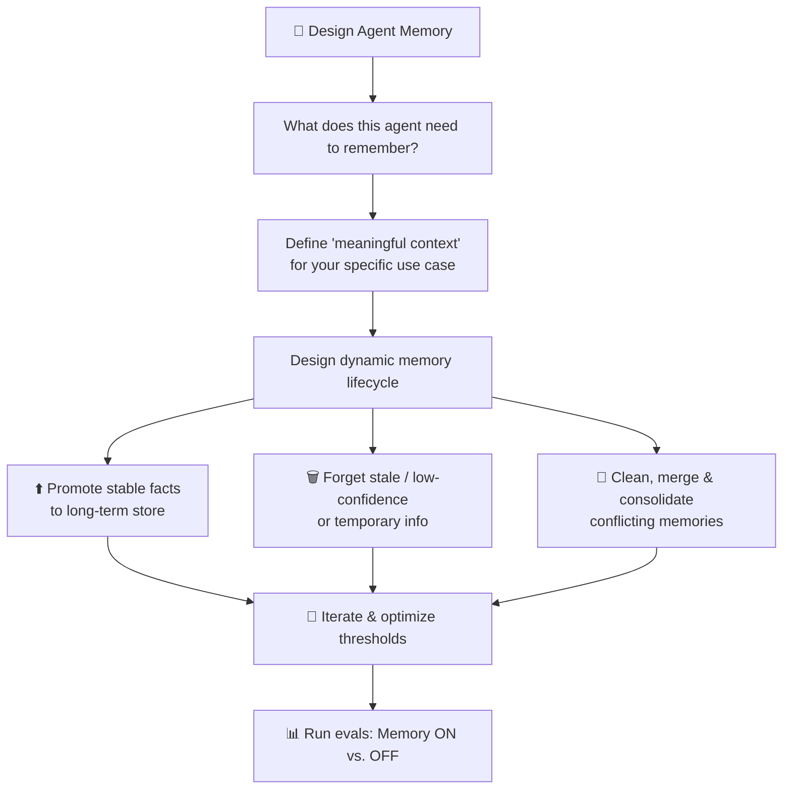

### Shape of Memory (Complexity Spectrum)

```
Simple ─────────────────────────────────── Complex
  │                                           │
Key-value pairs    Structured JSON    Rich paragraph
"device: MacBook"  {device, OS, ...}  Full narrative summary
```

**Recommendation:** Start simple, evolve as needed.

---

## 12. Evaluating Memory Performance

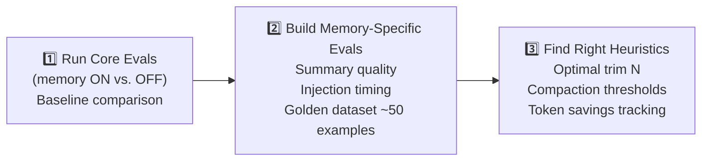

**Metrics to track:**
- Completeness of responses
- Task success rate
- Token savings (cost reduction)
- Summary accuracy vs. hallucination rate

---

## 13. Scaling Agent Memory Systems

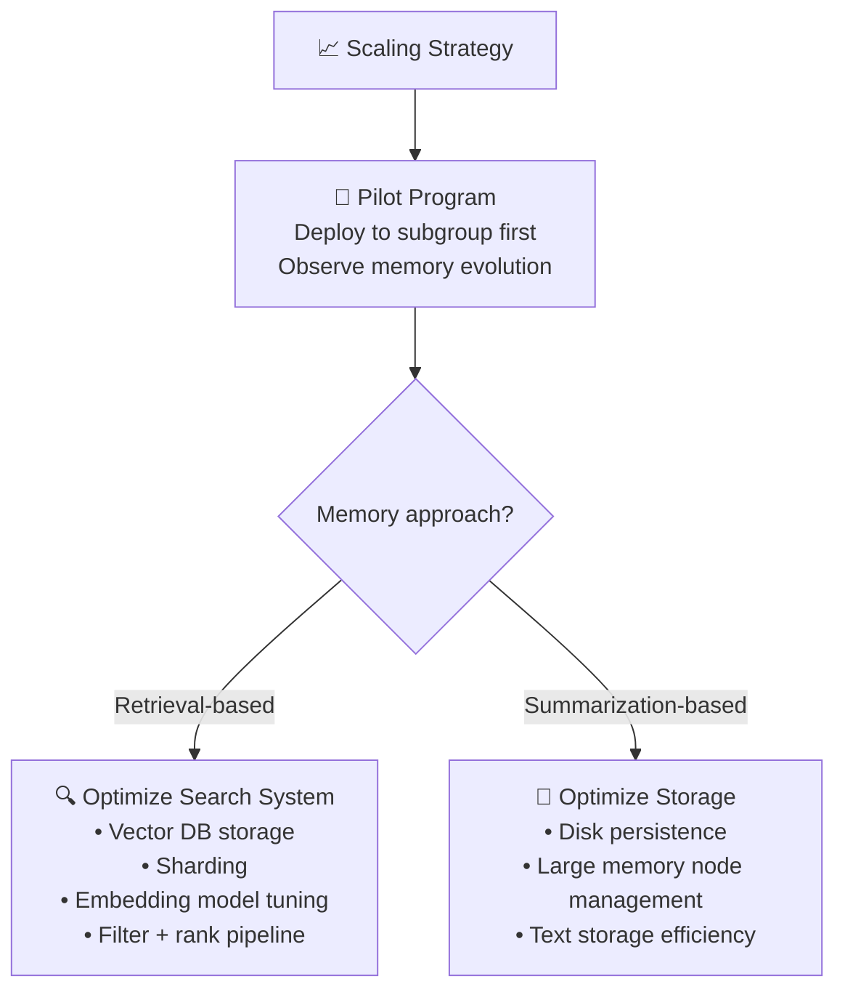

### Scale Requirements by Agent Type

| Agent Type | Memory Volume | Evolution Speed | Scale Priority |
|------------|--------------|----------------|----------------|
| **Travel Concierge** | Low (seat, hotel prefs) | Slow | Storage efficiency |
| **Life Coach** | Very high (goals, history) | Fast | Retrieval speed + freshness |
| **IT Support** | Medium (device, issue history) | Moderate | Summarization quality |

---

## 14. Memory Pruning & Temporal Decay

### Temporal Tagging Strategy

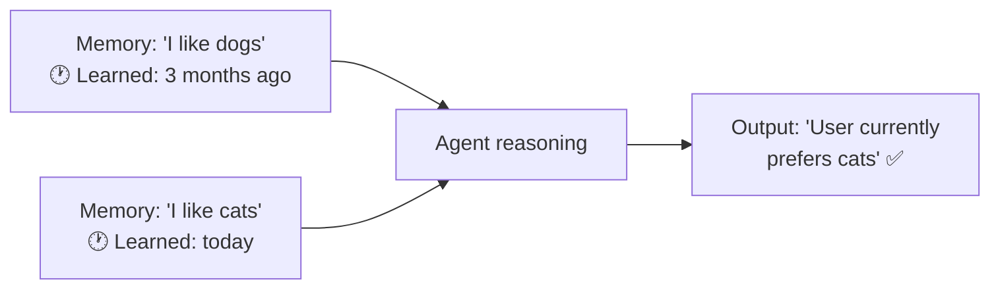

### Decay Strategies

| Strategy | How It Works | Best For |
|----------|-------------|---------|
| **Temporal Text** | Tag memories with timestamps; newer overrides older | Fast-changing preferences |
| **Weighted Decay** | Score memories by recency; downweight old ones | Gradual preference shifts |
| **Hard Expiry** | Delete memories older than X days/sessions | Highly time-sensitive data |
| **Consolidation** | Merge contradictory memories into unified state | Long-running, complex agents |

---

## 15. Key Takeaways & Resources

### The Three Core Questions of Memory Design

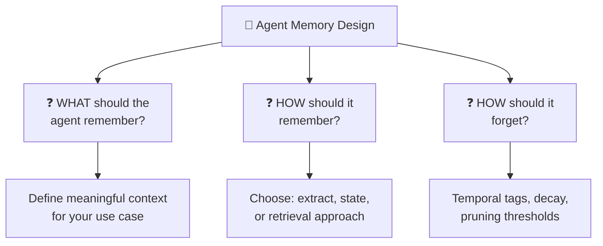

### Northstar Goal

> 🏆 **Aim for the smallest, highest-signal context possible.**

Every token in context should earn its place.

---

### 📚 Resources

| Resource | Purpose |
|----------|---------|
| **Context Engineering Cookbook** | Patterns and strategies reference |
| **Context Summarization Cookbook** | Summarization implementation guide |
| **Agents Python SDK (OpenAI)** | Build agents with custom session control |
| **Full Build Hour Repo (GitHub)** | Demo app + all linked resources |

---

### Quick Decision Flowchart

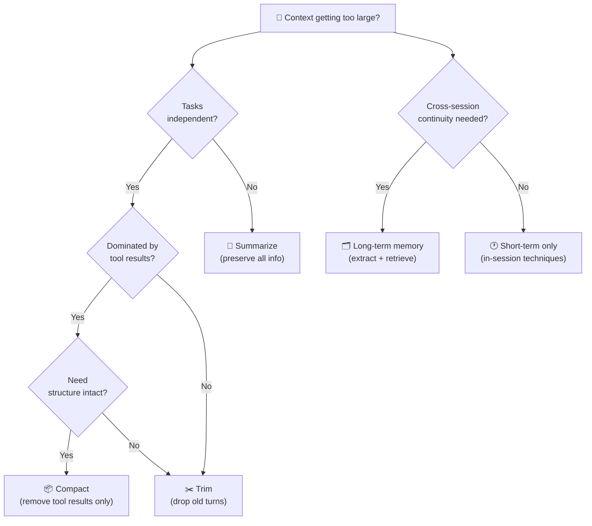

---

*Notes compiled from: Introduction to Agent Memory and Context Engineering session*