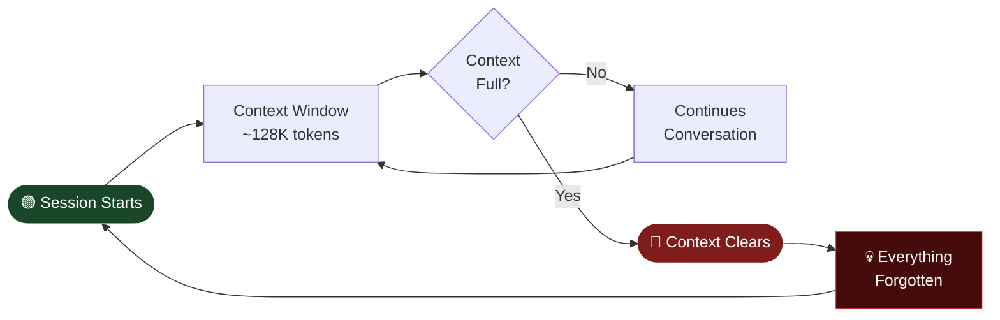
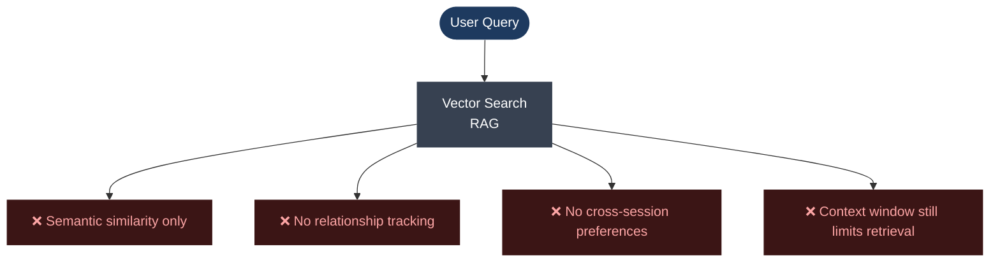
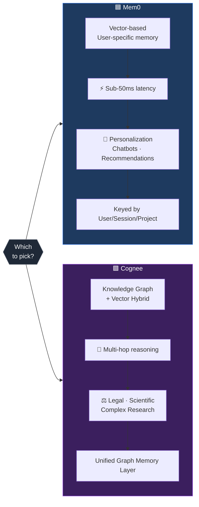
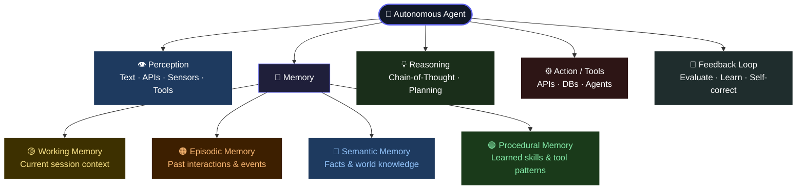
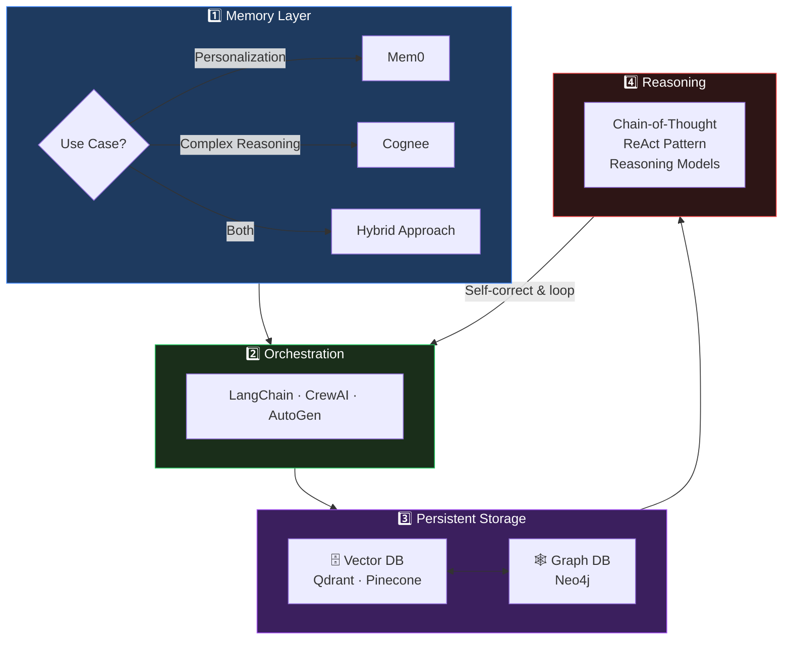

# 🧠 The Memory Problem in AI Agents

---

## ⚡ Core Issue: The Memento Problem

> **Every conversation starts at "Day Zero" — like waking up with total amnesia each session.**

---

## 🗂️ Why Simple RAG Isn't Enough

---

## 🔍 Mem0 vs Cognee — Side by Side

---

## 🤖 What Makes an Agent Truly Autonomous?

---

## 🏗️ Recommended Architecture for Your Autonomous Agent

---

## 🔑 Quick Reference

| Component | What It Does | Tool Options |
|---|---|---|
| 🧠 Memory | Stores & retrieves knowledge | Mem0, Cognee, ChromaDB |
| ⚙️ Orchestration | Coordinates agent steps | LangChain, CrewAI, AutoGen |
| 🗄️ Vector DB | Semantic similarity search | Qdrant, Pinecone, Weaviate |
| 🕸️ Graph DB | Relationship tracking | Neo4j, ArangoDB |
| 💡 Reasoning | Problem-solving pattern | ReAct, CoT, ToT |

---

> 💡 **TL;DR** — Use **Mem0** for user personalization, **Cognee** for complex reasoning, pair either with a **Vector + Graph DB hybrid**, and orchestrate with **LangChain/CrewAI**.