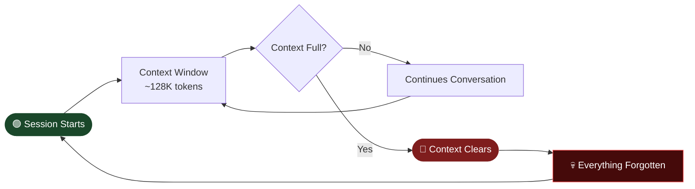

# 🧠 The Memory Problem in AI Agents

> Every conversation starts at **"Day Zero"** — like waking up with total amnesia each session.
> This is called the **Memento Problem**, and it's one of the hardest unsolved challenges in building autonomous AI agents.

---

## Table of Contents

- [The Memento Loop](#the-memento-loop)
- [Why Simple RAG Isn't Enough](#why-simple-rag-isnt-enough)
- [Autonomous Agent — Core Components](#autonomous-agent--core-components)
- [Memory Layers Explained](#memory-layers-explained)
- [Current Problems — Why Memory Is NOT Solved](#current-problems--why-memory-is-not-solved)
- [Why It's Still Unsolved](#why-its-still-unsolved)
- [Current Best Approaches (2025–2026)](#current-best-approaches-20252026)
- [Quick Reference](#quick-reference)

---

## The Memento Loop

LLMs are **stateless functions**. Every session starts fresh with a fixed context window (~128K tokens). Once that window fills and clears, everything is gone.

---

## Why Simple RAG Isn't Enough

Traditional vector-based RAG retrieval solves *some* of the problem — but not enough.

| Limitation | What It Means |
|---|---|
| ❌ Semantic similarity only | Finds similar text, not relationships between facts |
| ❌ No relationship tracking | Can't reason across connected concepts |
| ❌ No cross-session memory | User preferences reset every session |
| ❌ Context window bottleneck | Retrieved chunks still compete for limited space |

---

## Autonomous Agent — Core Components

A truly autonomous agent needs more than just an LLM. It needs six interlocking components.

| # | Component | Role |
|---|---|---|
| 1 | 👁️ **Perception** | Process inputs — text, APIs, sensors, tools |
| 2 | 🧠 **Memory** | Retain knowledge across time (see layers below) |
| 3 | 💡 **Reasoning** | Chain-of-thought, planning, problem-solving |
| 4 | 📋 **Planning** | Decompose goals, sequence tasks |
| 5 | ⚙️ **Action / Tools** | Execute decisions via APIs, DBs, other agents |
| 6 | 🔄 **Feedback Loop** | Evaluate outcomes, self-correct, learn |

---

## Memory Layers Explained

Memory isn't a single thing — it has four distinct layers, each serving a different purpose.

| Layer | Stores | Example |
|---|---|---|
| 🟡 **Working Memory** | Current session context | What the user just said |
| 🟠 **Episodic Memory** | Past interactions & events | "Last week you asked about X" |
| 🔵 **Semantic Memory** | Facts, world knowledge | Domain data, documentation |
| 🟢 **Procedural Memory** | Learned skills & tool patterns | How to call a specific API |

---

## Current Problems — Why Memory Is NOT Solved

### 1. Context Rot

Enlarging context windows doesn't fix the problem — it makes it worse. Research shows that as context grows, **model performance degrades**. The model loses focus on what's relevant. More isn't better.

### 2. Storage vs. Retrieval Mismatch

No single system does both storage and retrieval well today.

| System | Good At | Bad At |
|---|---|---|
| Vector DB | Semantic similarity search | Tracking relationships between facts |
| Graph DB | Relationship reasoning | Scaling to large query volumes |
| Hybrid | Both partially | Complex to maintain and tune |

### 3. The Compression Problem

Human memory compresses, abstracts, and prioritizes automatically. Current AI systems can't replicate this:

- **Store too much raw data** → expensive and noisy
- **Summarize too aggressively** → lose critical nuance
- **Can't determine what's "important"** → no automatic prioritization

### 4. Multi-Agent Memory

When multiple agents collaborate, memory problems multiply:

- Each agent may hold **different or conflicting information**
- No shared context layer across agents
- The Groundhog Day problem persists across the entire system, not just one agent

### 5. Privacy & Security

Persistent memory introduces real compliance risk:

- Storing user data long-term raises **GDPR / CCPA concerns**
- Unclear ownership — who controls what the agent remembers or forgets?
- Memory datastores become high-value attack targets

### 6. False Memories & Hallucinations

Stored memories are not verified. Once incorrect information is written:

- It gets retrieved as **established fact**
- No built-in mechanism to audit, verify, or correct stored memories
- Errors compound over time as the agent builds on bad foundations

### 7. Scalability

As usage grows, memory systems degrade:

- Memory grows **unbounded** without explicit pruning strategies
- Retrieval latency increases as the store grows
- Token costs for retrieval add up fast at scale

---

## Why It's Still Unsolved

| Reason | Explanation |
|---|---|
| 🏗️ No agreed-upon architecture | Vector, graph, and summarization approaches all have tradeoffs — no clear winner |
| 📏 No standardized benchmarks | Hard to measure what "good memory" even means (LOCOMO exists but isn't widely adopted) |
| ⚖️ Fundamental tension | More memory = more noise = worse performance |
| 🧬 Human memory is complex | We don't fully understand biological memory well enough to replicate it |
| 💸 Cost vs. quality | Accurate, high-fidelity memory is expensive; cheap memory is lossy |

---

## Current Best Approaches (2025–2026)

| Tool | Approach | Best For |
|---|---|---|
| **Mem0** | Vector-based, user-specific memory | Personalization, chatbots, recommendations |
| **Cognee** | Knowledge graph + vector hybrid | Complex reasoning, legal/scientific research |
| **Zep** | Temporal memory with fact extraction | Long-running assistants, session continuity |
| **Letta** | Stateful LLM agents with in-context memory management | Agents that need fine-grained memory control |

> **No single solution** handles all aspects: storage, retrieval, prioritization, forgetting, and privacy.

---

## Quick Reference

| Component | What It Does | Tools |
|---|---|---|
| 🧠 Memory | Stores & retrieves knowledge across sessions | Mem0, Cognee, Zep, Letta |
| ⚙️ Orchestration | Coordinates agent steps and decision flow | LangChain, CrewAI, AutoGen |
| 🗄️ Vector DB | Semantic similarity search | Qdrant, Pinecone, Weaviate |
| 🕸️ Graph DB | Relationship tracking and multi-hop reasoning | Neo4j, ArangoDB |
| 💡 Reasoning | Problem-solving patterns | ReAct, CoT, ToT |

---

> **TL;DR** — Use **Mem0** for personalization, **Cognee** for complex reasoning. Pair with a **Vector + Graph DB hybrid**, orchestrate with **LangChain / CrewAI**. But know that memory in AI agents is still an open problem — every approach involves real tradeoffs.